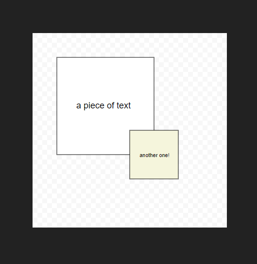

# svg-object-renderer

> Provides selection and hovering primitives for SVG objects for React apps

[](https://standardjs.com)

## Install

```bash
yarn add http://git.offthegrid/Jeroen/svg-object-renderer.git
```

## Features

- Multiselect
    - Use CTRL and click to multiselet
    - Only allows multi-selections of one type
- Hover feedback

## Usage

```jsx
import React, { Component } from 'react'

import SVGEditableCanvas, {
  RectObject, TextObject
} from 'svg-editable-canvas';

class App extends Component {
  objects = [
    {
      type: 'rect',
      x: 50,
      y: 50,
      width: 200,
      height: 200
    },
    {
      type: 'text',
      x: 75,
      y: 150,
      text: 'Hello World 🦄',
      style: {
        fill: 'white'
      }
    }
  ]

  objectTypes = {
    rect: RectObject,
    text: TextObject
  }

  render() {
    return (
      <SVGEditableCanvas
        objects={this.objects}
        objectTypes={this.objectTypes}
        onSelectionChange={selectedObjects => {
          // array of indices from `objects`
          console.log(selectedObjects);
        }}
      />
    );
  }
}

export default App;
```

This renders:



## Options

*multipleTypeSelection*
> default: `false`

Allows selecting objects of different types. Default behaviour is disallowing selecting multiple different types.

```jsx
<SVGEditableCanvas multipleTypeSelection={true} />
```

## Development

In one terminal build the library files:
```bash
yarn watch
```

Launch the demo app in another terminal:
```bash
cd demo && yarn start
```

⚡
