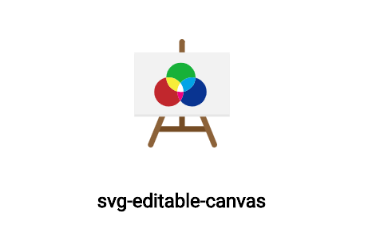
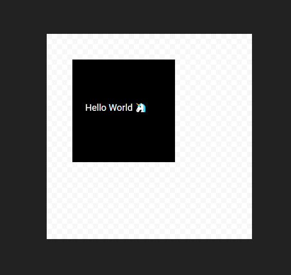

# 

## svg-editable-canvas
> Provides selection and hovering primitives for SVG objects

```
yarn add http://git.offthegrid/Jeroen/svg-editable-canvas.git
```

### Usage

```js
import SVGEditableCanvas, {
  RectObject, TextObject
} from './lib/index';

class App extends Component {
  objects = [
    {
      type: 'rect',
      x: 50,
      y: 50,
      width: 200,
      height: 200
    },
    {
      type: 'text',
      x: 75,
      y: 150,
      text: 'Hello World 🦄',
      style: {
        fill: 'white'
      }
    }
  ]

  objectTypes = {
    rect: RectObject,
    text: TextObject
  }

  render() {
    return (
      <SVGEditableCanvas
        objects={this.objects}
        objectTypes={this.objectTypes}
      />
    );
  }
}

export default App;
```

This renders:



### Development

Clone the repo and run:

```shell
yarn start
```
